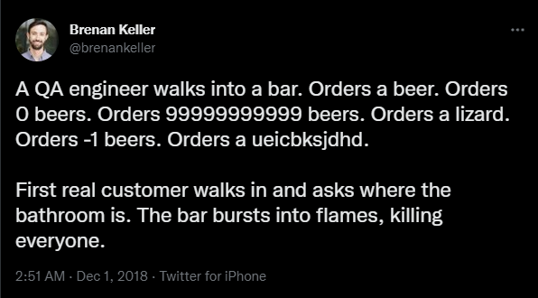

# Testing



## What is BATS?
Bats is a TAP-compliant testing framework for Bash. It provides a simple way to verify that the UNIX programs you write behave as expected.

A Bats test file is a Bash script with special syntax for defining test cases. Under the hood, each test case is just a function with a description.

## Installation
1. Create a folder named `bin` in your `$HOME` directory. And, run below commands to install bats.
NOTE: Add `$HOME/bin` in your `$PATH` variable.

```bash
 git clone https://github.com/bats-core/bats-core.git
 cd bats-core
 ./install.sh $HOME
```

2. On successful installation, it will display below message.
```bash
$ ./install.sh $HOME
Installed Bats to /c/Users/machine/bin/bats
```

3. To verify, just run the command `bats` inside your shell.

## Structure
1. Add a `src` folder inside your root project that contains the shell script to test.
2. Add a `test` folder to write your bats test.
3. Add `main.bash` inside your `src` directory that contains the source code.
4. Add `test_helper.bash` insdie your `test` directory to write helper functions.
5. Add extenstions for `bats` by adding two git submodules using below commands to run from your project root folder.
```bash
git submodule add https://github.com/bats-core/bats-support.git test/test_helper/bats-support
git submodule add https://github.com/bats-core/bats-assert.git test/test_helper/bats-assert
```

## Writing tests for code
1. The main source code is located in file [main.bash](./src/main.bash).
2. Add helper code for setup and teardown in [test_helper.bash](./test/test_helper.bash).
3. Add a file named `test_main.bats`, extension should be `.bats`. Bats will run n+1 function. The one additional function is to count the number of tests in a file. The naming convention for file and function is similar to writing tests for `golang`. And, hence the filename.
4. There is a variable `$BATS_TEST_DIRNAME` that holds the value of test directory for bats and it helps to `source` the `main.bash` code in our test file.
5. Mocking commands to save resources like `curl`.
   